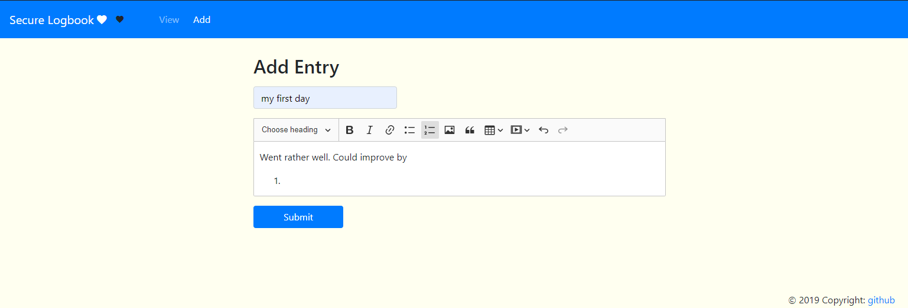

# MyStory

A web based logbook which allows you to add, remove, view and update entries. The data is encrypyed and stored locally.

## Getting Started

These instructions will get you a copy of the project up and running on your local machine for development and testing purposes. See deployment for notes on how to deploy the project on a live system.

### Screenshots

    
<b>Viewing logbook</b>

 
<b>Adding a record</b>

## Deployment

Run by executing `mvn spring-boot:run` in command line

## Built With

* [Spring Boot](https://spring.io/projects/spring-boot)
* [Thymeleaf](https://www.thymeleaf.org/) - Front end templates
* [Maven](https://maven.apache.org/) - Dependency Management
* [Bootstrap](https://getbootstrap.com) - CSS and styling
* [ckeditor](https://ckeditor.com) - Interactive text
* [ionicons](https://ionicons.com/) - Icon package

## License

This project is licensed under the MIT License - see the [LICENSE.md](LICENSE.md) file for details

